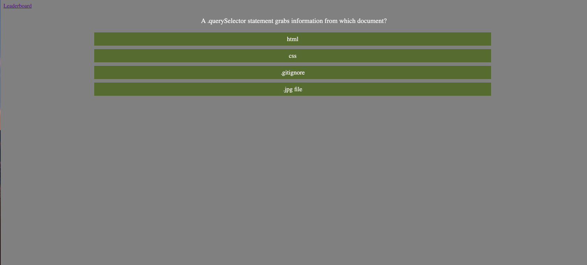

# Coding Quiz Homework 4
We were tasked to create an interactive quiz for the users. There is a 75 second time limit for the user. Each time they answer a question right, they gain a point. If they answer a question wrong, they lose five seconds off of their timer. 
In the end, they're score is generated and pasted onto a seperate page called the Leaderboard.
My page includes two JavaScript files, two HTML files and two CSS files. 
![Front-Page] (./images/initialpage.png)
## What All Went Into Creating This Quiz

I started out by creating a vanilla HTML file that had three classes/Id's that I wanted to grab. 
Through the use of query Selectors, appendicies, event listeners and createElement functions, I was able to create the elements needed for the quiz without having to write a ton of HTML. 
I utilized the query selector to grab elements from my HTML pages to create functions, add event listeners, and to create new atrributes to existing elements on my HTML webpage. 

### What it includes

This code has 14 different buttons. They all serve a different purpose. The user will press the "Get Started!" button to begin the quiz. Then they will be prompted with 4 questions that have four seperate answers they can chose from. The application will check the answers and generate their score. They will then be prompted with an input section that asks for their initials. Once the user presses the submit button, they are redirected to the Leaderboard page. 
From there they can see the high scores of all who have taken the quiz in the past. They can clear the leaderboard by pressing the 'Reset High Scores' button. They can also return to the quiz and try again by pressing the 'Return to Page!' button.

#### Troubleshooting Issues

For some reason when my page is deployed and the user finishes the quiz, it takes them to a page called TopScorers.html instead of the topScorers.html that is in my code. it causes a 404 error page and I am not sure why it does that. 
If the user changes it back to topScorers.html, the leaderboard shows up. I could not solve the issue. 